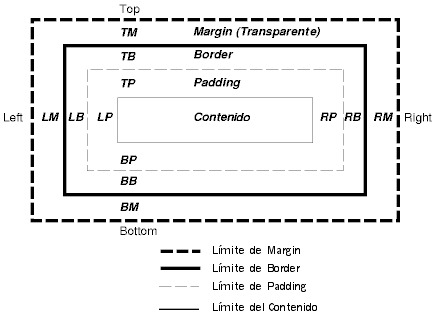

# Modelo de Caja

El modelo de caja hace referencia a todos los elementos de HTML los cuales se representan mediante cajas rectangulares. Cada etiqueta de HTML representa una caja rectangular que encierra el contenido de esta.

Las partes del modelo de caja son:

- **Content:** el contenido donde esta el texto e imágenes.
- **Padding:** El área que sigue del contenido, se encuentra entre el borde y el contenido.
- **Border:** envuelve el padding y el contenido.
- **Margin:** es el área transparente que esta afuera del borde y se encarga de separar de las demás cajas.

Margin, border y padding pueden ser divididos en los segmentos left, right, top y bottom (ej., en el diagrama, "LM" para left margin, "RP" para right padding, "TB" para top border, etc.).

El perímetro de cada una de las cuatro áreas (contenido, padding, border y margin) es llamado "límite", de manera que cada caja tiene cuatro límites:

**límite del contenido o límite interno**

El límite del contenido rodea al contenido procesado del elemento.

**límite de padding**

El límite de padding (relleno) rodea a la caja de relleno. Si padding tiene un ancho de 0, el límite del relleno es el mismo que el límite de contenido. El límite del relleno de una caja define el límite de la caja de contención establecida por la caja.

**límite de border**

El límite de border (borde) rodea el borde de la caja. Si border tiene un ancho de 0, el límite del borde es el mismo que el límite del relleno (padding).

**límite de margin o límite externo**

El límite de margin (margen) rodea el margen de la caja. Si margin tiene un ancho de 0, el límite del margen es el mismo que el límite del borde (border).

Cada límite puede dividirse en límite left (izquierdo), right (derecho), top (superior) y bottom (inferior).